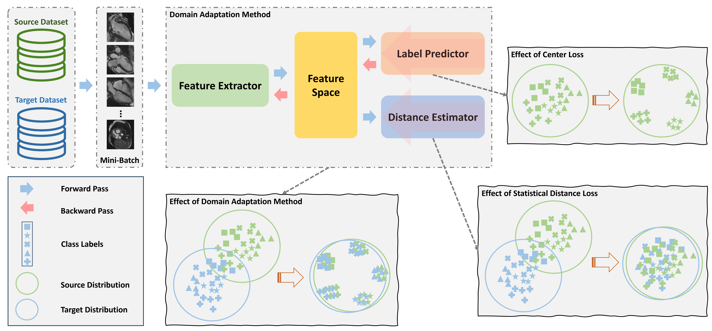

<div align="center">

<samp>

<h1> Statistical Distance-Guided Unsupervised Domain Adaptation for Automated Multi-Class Cardiovascular Magnetic Resonance Image Quality Assessment </h1>

[//]: # (<h4>  </h4>)

</samp>   

</div> 

[](https://arxiv.org/abs/2409.00375)


This repository contains the official implementation of the research paper titled "Statistical Distance-Guided Unsupervised Domain Adaptation for Automated Multi-Class Cardiovascular Magnetic Resonance Image Quality Assessment". The proposed method addresses domain shift between two datasets: a labeled source dataset and an unlabeled target dataset. It employs a convolutional neural network to extract features from shuffled mini-batches composed of both source and target data. The extracted features are utilized by a label predictor and a distance estimator network. The label predictor aims to enhance class separability by reducing intra-class distance and increasing inter-class distance. The distance estimator approximates the statistical distance between the source and target data distributions within each mini-batch. This estimated distance is incorporated into a combined loss function to handle domain shift. By jointly leveraging these networks, the proposed method extracts domain-independent features with improved separability for each class. Hence, the model demonstrates enhanced performance when confronted with unlabeled target data. 

<p align="center">
  
</p>

The model's primary application is the identification of four common types of artifacts in CMR imaging. By analyzing images or k-space with short or long-axis views post-imaging, the proposed model can accurately classify the specific type of artifact present. This capability allows for early identification of artifacts before further diagnostic analysis, leading to improvements in the overall diagnosis process.

Furthermore, the model is capable of performing real-time data analysis, enabling timely insights and contributing to the enhancement of diagnostic procedures. Additionally, it offers the ability to automatically evaluate the quality of images in large cohort studies, streamlining the assessment process in research and clinical settings.

<p align="center">
  
</p>

## Citation

If you find our code or paper useful, please cite as:

```bibtex
@article{nabavi2024statistical,
  title={Statistical Distance-Guided Unsupervised Domain Adaptation for Automated Multi-Class Cardiovascular Magnetic Resonance Image Quality Assessment},
  author={Nabavi, Shahabedin and Hamedani, Kian Anvari and Moghaddam, Mohsen Ebrahimi and Abin, Ahmad Ali and Frangi, Alejandro F},
  journal={arXiv preprint arXiv:2409.00375},
  year={2024}
}
```
